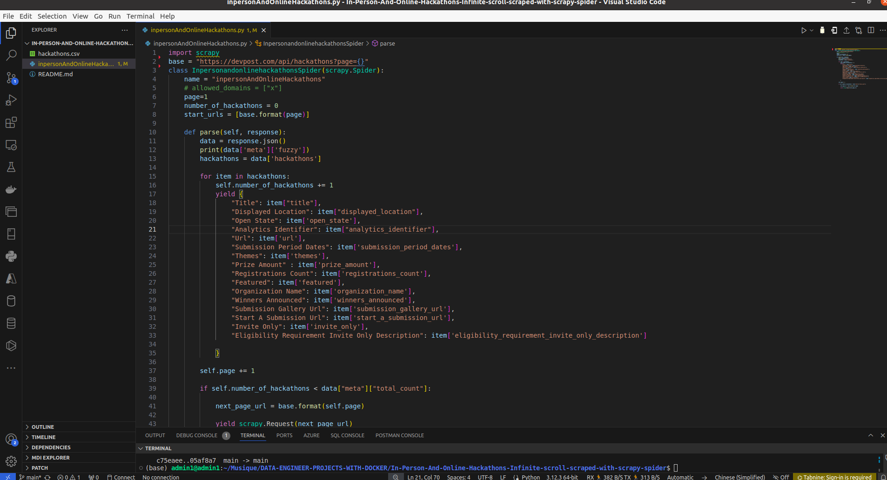

# In-Person-And-Online-Hackathons-Infinite-scroll-scraped-with-scrapy-spider
In Person And Online Hackathons Infinite scroll scraped with scrapy spider

### PROCESS TO RUN THIS SCRAPY SPIDER

##### Firstly be sure that you have scrapy installed . Otherwise install it with : pip install scrapy

##### After that you can generate now a single spider with: scrapy genspider "name of your spider" "following by domains if you want to add it"

##### Finally you can copy just the content of the quotestoscrapespider.py file into your file 

##### Just run it now with : scrapy runspider filename

##### Additionally , if you want to save the output to a csv file or others options , run this command: scrapy runspider "your spider file name".py -o "your desired csv file name".csv -t csv

# COMMANDS RAN TO SCRAPE THE DATA:

### scrapy genspider inpersonAndOnlineHackathons x

### scrapy runspider inpersonAndOnlineHackathons.py -o hackathons.csv -t csv

## THANK YOU FOR YOUR ATTENTION!!

### **In-Person and Online Hackathons Scrapy Project**

### **Overview**
This Scrapy project scrapes data from the Devpost website's API to gather information about in-person and online hackathons. It retrieves details such as hackathon title, location, open state, URL, submission period dates, themes, prize amount, registrations count, organization name, winners announced status, and more.

### **Setup**
Ensure you have Python installed along with the Scrapy library.

### **Usage**
1. Run the Scrapy spider.
2. Wait for the spider to scrape hackathon data.
3. The scraped data will be printed, and you can process it further as needed.

### **How to Run**
1. Install Scrapy using `pip install scrapy`.
2. Run the Scrapy spider using the command `scrapy crawl inpersonAndOnlineHackathons -o output.json`.
3. Replace `output.json` with the desired output file name.

### **Dependencies**
- Python 3.x
- Scrapy

### **Notes**
- Customize the Scrapy spider's logic and parsing according to your requirements.
- Ensure compliance with Devpost's terms of service and API usage policies.
- Handle pagination if needed to scrape all available hackathon data.

### **Contributors**
- Gabin H. VEGLO

### **License**
#**This project is licensed under the MIT License.**#

